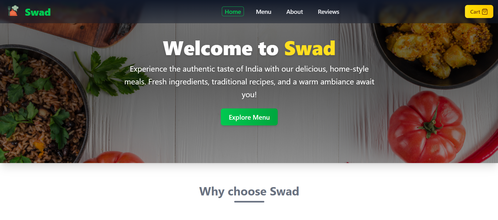

# Swad - The Taste

Swad is a modern, responsive web application for an Indian restaurant, offering a delightful digital experience for browsing menus, placing orders, and sharing reviews.

 

## Features

- **Home Page:** Hero section, highlights, and popular dishes.
- **Menu:** Browse all dishes with images, prices, and categories (Veg/Non-Veg).
- **Menu Details:** View detailed recipe steps and dish info.
- **Cart:** Add, remove, and update item quantities; see total price.
- **Reviews:** Read and submit customer reviews with ratings.
- **About:** Learn about the restaurant's story, vision, mission, and team.
- **Responsive Design:** Fully mobile-friendly and accessible.
- **Persistent Cart & Reviews:** Cart and reviews are stored in localStorage.
- **Toast Notifications:** User feedback for cart actions and review submissions.

## Tech Stack

- **Frontend:** React 19, Vite, Tailwind CSS
- **Routing:** React Router
- **Icons:** Lucide React
- **State Management:** React hooks, localStorage
- **Notifications:** react-hot-toast

## Contact:

_For any questions or feedback, please contact:_

**Ravikant Tarare**

📩 [ravikanttarare2001@gmail.com](mailto:ravikanttarare2001@gmail.com)

📞 [8275957698](tel:8275957698)
